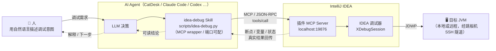

# Breeze Dev Helper

一个 IntelliJ IDEA 开发提效插件，由两套相互独立的能力组成：

1. **AI 调试控制（MCP Server）** —— 在本地起一个 HTTP/SSE MCP Server（默认 `19876`），把 IDEA 的调试器能力以 [Model Context Protocol](https://modelcontextprotocol.io) 暴露出去，让 AI 助手能直接打断点、读变量、求值表达式、单步执行，全程不用手动操作 IDE。
2. **代码 ↔ 文档双向跳转** —— 在源码注释里用 `@spec <path>.md` 跳到规格文档；在 Markdown 里用 `spec-jump://` 链接跳回源码。

> 当前版本 `0.4.3`，要求 IntelliJ 平台 `261+`（2026.1 起），Java 21，依赖 Java / Markdown / XDebugger / Terminal 模块。

**相关链接**

- 插件主页（JetBrains Marketplace）：<https://plugins.jetbrains.com/plugin/31365-breeze-dev-helper>
- `idea-debug` Skill（Friday 技能广场）：<https://friday.sankuai.com/skills/skill-detail?activeTab=overview&activeTestTab=cases&id=87008>

---

## 一、使用说明

### 方式 A：通过 `idea-debug` Skill（推荐，跨 Agent 通用）

如果你在 CatDesk / Claude Code / Codex / Gemini 等任意 Agent 里使用，推荐直接用 [`idea-debug` Skill](https://friday.sankuai.com/skills/skill-detail?activeTab=overview&activeTestTab=cases&id=87008)，它在插件之上封装了一层零依赖的 MCP wrapper（`scripts/idea-debug.py`），帮你：

- **自动安装/更新插件**：`idea-debug.py install-plugin` 会检测 IDEA 是否在运行、定位安装路径、对比本地与 JetBrains Marketplace 版本，自动下载最新版（失败则回退到内置离线 jar），并重启 IDEA、等待 MCP 就绪。
- **统一调用 MCP**：`idea-debug.py check` 探活、`tools` 列工具、`call <tool> [k=v...]` 调用任意工具、`status` 查状态，参数自动类型转换，免去手写 JSON-RPC。
- **端口可配**：优先级 `--port` > 环境变量 `IDEA_DEBUG_MCP_PORT` > 默认 `19876`。

这样无论在哪个 Agent 里，都能用同一套命令完成调试，不必各自实现 MCP 客户端。

### 方式 B：直接在 IDE 里使用

1. 安装插件：在 [JetBrains Marketplace 插件主页](https://plugins.jetbrains.com/plugin/31365-breeze-dev-helper) 安装（或在 IDE 里 **Settings → Plugins** 搜索 *Breeze Dev Helper*，也可加载本仓库构建出的 jar）。
2. 在 **Settings → Tools → Breeze Dev Helper** 中配置：
   - **MCP Server**：启用开关、监听端口
   - **Jumper SSH Tunnel**：MIS ID、跳板机地址、代理脚本路径、SSH key 路径
   - **Comment Keyword**：默认 `@spec`
   - **Link Protocol Prefix**：默认 `spec-jump://`
3. 在 AI 客户端配置 MCP endpoint：`http://localhost:19876/mcp`。

### 文档跳转用法

代码 → 文档：在 Java / Kotlin / Scala 注释里写 `@spec docs/foo.md`，`Ctrl/Cmd+B` 或 `Ctrl/Cmd+Click` 跳转。

文档 → 代码：在 Markdown 里放 `spec-jump://` 链接，`Ctrl/Cmd+B`、`Ctrl/Cmd+Click` 或在预览面板点击即可跳转，支持：

```
spec-jump://com.example.MyClass            跳到类
spec-jump://com.example.MyClass#myMethod   跳到方法/字段
spec-jump://com.example.MyClass:42         跳到行号
spec-jump://com.example.MyClass#myMethod:42  方法 + 行偏移
```

---

## 二、MCP 调试工具一览

在 AI 客户端里把 MCP endpoint 配成 `http://localhost:19876/mcp` 即可使用：

| 工具 | 作用 |
|------|------|
| `setup` | 一站式初始化：自动探测 idea CLI 与 jumper SSH 配置 |
| `create_remote_debug_config` | 创建 Remote JVM Debug 配置，并自动经跳板机建立 SSH 隧道 |
| `list_run_configurations` | 列出项目所有 Run Configuration |
| `launch_debug` / `stop_debug` | 连接 / 断开调试器 |
| `add_breakpoint` / `remove_breakpoint` / `list_breakpoints` | 断点管理（统一用 `className + line`） |
| `get_debug_status` | 当前会话状态：`NO_SESSION` / `RUNNING` / `PAUSED at file:line` |
| `read_variables` / `get_stack_frames` | 检查当前暂停帧的变量与调用栈 |
| `evaluate_expressions` | 在当前帧批量对 Java 表达式求值 |
| `resume_debug` / `step_over` / `step_into` / `step_out` | 执行控制 |

典型流程（Agent 视角）：

```
list_run_configurations → add_breakpoint → launch_debug
   → get_debug_status(轮询到 PAUSED) → read_variables / evaluate_expressions
   → step_over / step_into → resume_debug → stop_debug
```

完整规格、参数与返回示例见 [`docs/mcp-debug-spec.md`](docs/mcp-debug-spec.md)。

---

## 三、设计理念

下图是「人 → AI Agent → 插件 → IDEA」整条调试链路的交互关系：



要点：人只表达意图，Agent 经 Skill 把意图翻译成 MCP 工具调用，插件再驱动 IDEA 里**真实的**调试器去操作目标 JVM；结果沿原路回传。下面五条理念都围绕"让这条链路尽量短、尽量真实、尽量可闭环"展开。

### 1. 让调试器成为 Agent 的"手"，而不是让 Agent 去模拟人

传统做法是 AI 给出"在第 42 行打断点、看一下 user 变量"这类自然语言建议，再由人去 IDE 里手动操作。Breeze Dev Helper 反过来：把 IDEA 内部真实的 `XDebugSession` 直接搬到 MCP 协议上。Agent 调用 `add_breakpoint`、`launch_debug`、`read_variables`，命中的就是 IDE 里真实的断点与真实的调试会话，状态、变量、调用栈和你肉眼在 IDE 里看到的完全一致。插件只负责"忠实地把 IDE 的调试能力转译成工具调用"，不做任何模拟或推测。

### 2. 接口语义对 Agent 友好，而不是对实现友好

调试规格（见 `docs/mcp-debug-spec.md`）刻意把所有断点操作统一成 `className + line` 这种人类/AI 都能直接理解的形式，而不是暴露 `fileUrl` 绝对路径。这样 Agent 不需要先 `list` 再 `remove` 的两步绑定，`add` 和 `remove` 完全对称，一次调用即可完成。同理，`list_breakpoints` 输出 `com.example.MyService:42 [enabled]` 这种可读文本，`get_debug_status` 直接给出 `NO_SESSION / RUNNING / PAUSED at file:line`，让 Agent 用状态查询代替"靠错误响应反推会话是否存在"。

### 3. 状态可见 + 最小往返，保证工作流能闭环

设计目标是 Agent 能独立走完「设置断点 → 启动调试 → 命中暂停 → 检查变量 → 单步 → 继续 → 停止」整条链路。为此补齐了 `get_debug_status`（状态可轮询）、`resume_debug / step_over / step_into / step_out`（执行控制）、`evaluate_expressions`（任意表达式求值）。其中步进类工具内部用 `XDebugSessionListener` 监听 `sessionPaused`，调用后会等待 IDE 重新暂停（最多若干秒）再返回新的暂停位置——把异步的调试器行为包装成 Agent 可同步等待的一次调用。

### 4. 远程调试开箱即用，隧道对 Agent 透明

针对美团内网场景，`create_remote_debug_config` 在创建 Remote JVM Debug 配置的同时自动通过跳板机（jumper）建立 SSH 隧道。Agent 只需给出目标服务，连接细节由插件 + `setup` 工具自动探测（idea CLI、jumper SSH 配置），隧道对上层完全透明。

### 5. 两套能力解耦

MCP 调试与文档跳转是两条独立链路，互不依赖：不需要调试时可以只用 `@spec` / `spec-jump://` 做代码与规格文档的双向导航；不写文档时调试能力也完全可用。

---

## 四、本地构建

```bash
./gradlew buildPlugin     # 产物在 build/distributions/
./gradlew runIde          # 启动带插件的沙箱 IDE
```

> 发布所需的 Marketplace token、签名证书等通过环境变量或 git-ignored 的 `gradle.local.properties` 注入，详见 `build.gradle`。
